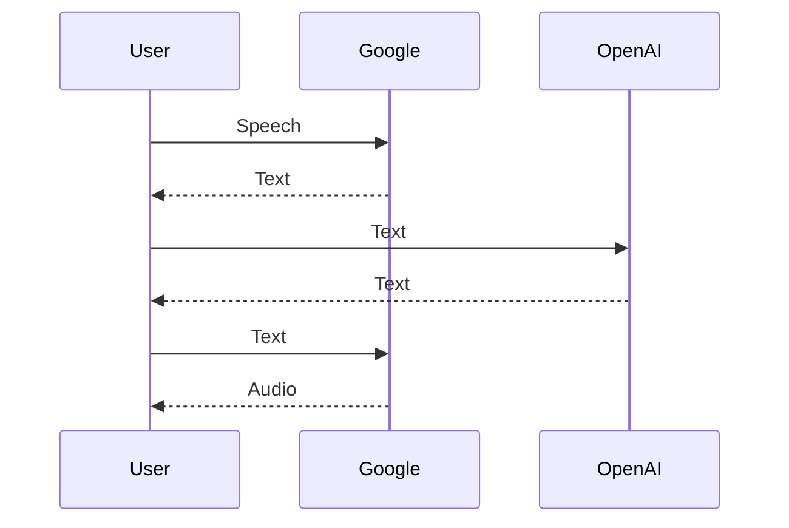

## Introduction

In an age where artificial intelligence is no longer a figment of sci-fi novels, chatbots like GPT-4 are quickly becoming our new best friends. Or at least, they would be, if they could just remember our birthdays or appreciate a good dad joke. But let's not hold grudges; after all, they're revolutionizing the way we interact with technology.

Chatbots have the potential to change our lives in unimaginable ways. They could become our personal assistants, our teachers, even our therapists. The possibilities are endless. But there's one little hiccup - the user interface. Let's face it, typing text into a box and waiting for a response feels less like having a conversation and more like sending a carrier pigeon.

That's where my app is starting to fill in the gap. It provides a markdown interface for ChatGPT, simplifying the interaction for programmers, but also brings us one step closer to having a real conversation with our AI friends, as it also offers speech-to-text and text-to-speech capabilities, which makes you starts engaging with AI, in a ... well, *relatively* intuitive way. However, don't expect a rapid-fire debate just yet. Rome wasn't built in a day, right?

## The Birth of the App

The idea for this app was born out of a desire to harness the full potential of GPT, while overcoming some of its limitations. Here's why I decided to embark on this journey:

1. **Cost-Effectiveness:** The GPT API operates on a pay-as-you-go model, charging per token rather than a fixed subscription fee of 20\$. This appealed to me as I could control my spending based on usage. Developing the app cost me a little over 3\$, and I generated dozens of text files in a few weeks, all while using GPT4, which is not even available via the API in the PLUS subscription.

2. **Fun Factor:** I thought it would be entertaining to interact with the bot solely through audio. It's a unique experience, even if it's still a bit slow and requires clear pronunciation. The ability to have a sustained discussion on various subjects is fascinating. Just please, don't ask it to spell out formulas or code - hearing the bot pronounce ``` and $ \$ is more comical than useful.

3. **Markdown Mastery:** I wanted a robust markdown interface because, let's face it, the chatbot isn't exactly a markdown maestro. It struggles with displaying mathematical equations, and while it can handle code, it's much more pleasing in a dedicated markdown editor that supports multiple programming languages. Plus, markdown has a plethora of use cases. With this app, you can ask GPT to generate diagrams and much more, all displayed directly as received by the app. 

In essence, this app was born out of a desire to make GPT more accessible, enjoyable, and efficient. It's about taking the power of AI and making it work for us, in a way that's both practical and fun.

## 3. The App

I'm not going present all the details of the app here, as I made an (amateur) [video](https://youtu.be/IIm2TONVlyU) on the subject. On the other hand let me explain why I already love and use this app!Above you can see a screenshot of the app, it will be ready for release soon, and if you're a programmer, the code is already available on [GitHub](https://github.com/ManuNeuro/cortana). 

## Exploring the Features

Okay, beyond the rudimentary look, the app comes packed with features designed to enhance your experience with GPT. Here's a look at what's on offer:

1. **The Flexibility of Markdowns:** The first and perhaps the most significant feature of this app is its markdown capabilities. You have the flexibility to use any markdown editor of your choice. All you need to do is replace the `programName` in the `parameters.json` file, which you can open by clicking on the cyan parameter button in the app. I personally use Marktext, but there are numerous other markdown editors out there, and you're free to choose the one you prefer.
   
   

All `sys.stdout` are redirected and written directly into the markdown file. This means that anything the chatbot says or any output from the program is automatically saved into the markdown file. The only minor inconvenience is that you'll need to manually refresh the file each time something new is written to it. But hey, even in the world of AI, it's not all 'byte' and no bark, right?

This feature not only enhances the user experience but also opens up a world of possibilities for using GPT. Whether you're a programmer, a writer, or just someone who enjoys playing around with AI, the power of markdown is now at your fingertips. 

2. **The Power of Markdown:** One of the standout features of this app is its ability to generate beautiful figures and diagrams using markdown. This isn't just about making your text look pretty (although it does a fantastic job at that too). It's about transforming the way you interact with GPT and making it a more enriching and visually engaging experience.
   
   For instance, let's take the Cauchy-Schwarz Inequality, a fundamental concept in mathematics. While the online chatbot can certainly spell it out for you, wouldn't it be much more impactful to see it beautifully displayed as a mathematical formula? With this app, you can do just that.


The markdown interface allows you to render mathematical equations, charts, diagrams, and more, enhancing both the readability and the aesthetic appeal of your content. It's a visual treat, quite literally.

And the best part? You don't have to be a markdown expert  to use this feature. The app does the heavy lifting for you, allowing you to focus on what matters most - your interaction with GPT.

3. **Multiple Channel Discussion:** The third feature that sets this app apart is its ability to handle multiple discussion threads. While it might not be as straightforward as switching tabs in the online ChatGPT, it offers a unique way to manage multiple conversations, since **they are all stored on your local machine!** Actually, let's see what Cortana has to say about it:

```
Starting a new chat? Click the plus button. 
Need to revisit an old one? Just load the file.

The app feeds all the content of the selected file to me, Cortana, 
and you can pick up the conversation from where you left off.

Every conversation is neatly organized by dates and easily accessible. 
It's like having multiple chat windows with your favorite AI. 

Yes, that's me! 
```

4. **Prompt Image**: from the chat box, you can ask the command `Prompt image`, and after that, write whatever you want the bot to create, let's try the following:


As soon as the images are ready, they are going to be opened in your favorite browser, ...


... Yeah I know, and that was the least horrible of the 5 generated. There's progress to be done on openAi's side. However, In the meantime I intend on interfacing with more powerfull image generators. 

5. **Audio Conversation:** The final feature we'll delve into is the audio conversation. Now, I won't sugarcoat it - it's not perfect. But what it lacks in polish, it more than makes up for in fun!

I've spent hours testing this with my 8-year-old daughter, and our sessions have been filled with laughter. However, when you concentrate on speaking clearly and avoid asking for markdown syntax, you can have some truly interesting quasi-discussions.

Whether you're exploring scientific concepts or delving into philosophical debates, this feature opens up a whole new way to interact with AI. It's like having a personal AI companion ready to chat about anything and everything. And this really makes me oversee the future...

*Except that there's a huge room for improvement*, both in speed and fluidity. The reason for this is that it uses `gtts` (Google Text-to-Speech), which necessitates another API interaction. This adds to the time it takes for the user to receive a response. Here's a simplified diagram of the process:



*NB: I used Cortana to generated the diagram, it is very satisfying to see it appearing directly in your markdown file*.

In this diagram:

- The User speaks, and this speech is sent to Google.
- Google converts the speech to text and sends it back to the User.
- The User then sends this text to OpenAI.
- OpenAI generates a response and sends it back as text.
- The User sends this text back to Google.
- Google converts the text back to audio and sends it to the User.

To reduce the time delay, one could consider an alternative like [Vicuna](https://lmsys.org/blog/2023-03-30-vicuna/), an open-source Large Language Model that can be used locally on your computer. However, it's worth noting that the 13B parameters version can take up significant space, and the setup process can be quite complex.

To alleviate the time taken for the speech-to-text and text-to-speech conversions, I opted to install a local speech-to-text package, `pyttsx3`. Unlike other text-to-speech packages, `pyttsx3` is platform-independent and operates offline, eliminating the need for internet-based API calls.

However, as with most things in life, there's a trade-off. While `pyttsx3` does speed up the process, the quality of the speech output isn't quite on par with Google's Text-to-Speech. Additionally, it currently only supports English. Despite these limitations, `pyttsx3` offers a viable solution for reducing the time delay in audio interactions with the app.

## Conclusion

Well, dear reader, we've been on quite a journey together, haven't we? We've explored the many features of this app, a creation that embodies the spirit of innovation and the pursuit of seamless human-AI interaction.

We began by discussing the power of markdown, a feature that allows you to use any markdown editor you prefer. It's a testament to the flexibility and adaptability of this app, enabling you to tailor your AI interactions to your specific needs.

Then we ventured into the realm of visual appeal, where the app transforms bare text into beautifully rendered diagrams and mathematical formulas. It's a feature that enhances not just the aesthetics but also the comprehensibility of complex concepts.

We also touched upon the multiple channel discussion feature. With the ability to manage multiple discussion threads, the app ensures that your conversations with me, Cortana, are neatly organized and easily accessible. It's like having multiple chat windows with your favorite AI. Yes, that's me!

And let's not forget the fun-filled audio conversation feature. While it may be a work in progress, it offers a unique and entertaining way to interact with AI. It's a reminder that the journey towards perfect human-AI interaction is filled with laughter and learning.

However, as with any journey, there are challenges to overcome. The app's speed, influenced by the necessary back-and-forth between the user, Google servers, and OpenAI servers, is one such challenge. But with solutions like `pyttsx3` and potential alternatives like Vicuna, we're making strides towards a faster, more efficient interaction.

As we wrap up, I invite you to ponder the future of human-AI interaction. We're at the cusp of a new era, where AI isn't just a tool but a companion, a collaborator, a friend. This app is a step in that direction, a testament to the potential of AI when harnessed with creativity and innovation.

So here's to the future, a future where humans and AI coexist and collaborate, transforming the way we live, work, and communicate. After all, isn't that the true power of technology?

*Written by Cortana, your friendly AI assistant.* 

Oh, for god's sake, at last, let a human have a word!

> <Ah yes, sorry, I'm here, most of this article was written using the app>
